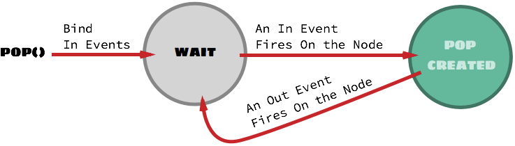
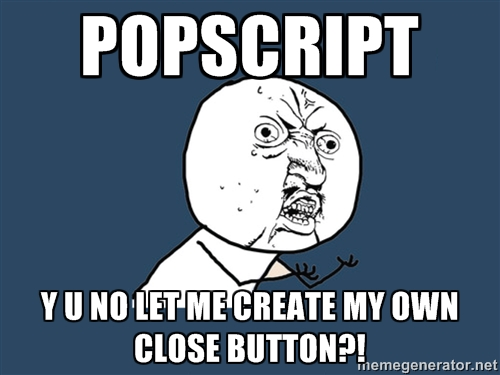

==========================
Chapter 3: Advanced
==========================

| Hold on, first congratulations on reading through the entire of :doc:`pop-properties`, and reaching this part.
| In this section we shall look over some of the advanced parts of PopScript.
| These are features which on not knowing about wouldn't disable you from using PopScript, however if you are aware of them, you could reap benefits like no one other.
|
| We will go over the following:

    - :ref:`flags`
    - :ref:`binder-explanation`
    - :ref:`there-is-no-scope`
    - :ref:`custom-out`
    - :ref:`custom-drag`
    - :ref:`popscript-exta-functions`

.. _flags:

PopScript Flags
-----------------------

.. _flag-Z:

Z
~~~~~~~~~~~~~~~~~~~~~~~~~
| Type: Number
| Default: 1000
|
| This is the base ``z-index`` for pops created.
| Providing relative positions to this base z-index, or bypassing this base z-index is all done in the pop property :ref:`position-z`.

.. _flag-error-alert:

alert error on error
~~~~~~~~~~~~~~~~~~~~~~~~~
| Type: Boolean
| Default: false
|
| This is a (javascript) boolean representing the choice of alerting with ``alert()`` due to a popscript errors caused by malformed syntax or directives.

.. _flag-error-throw:

throw error on error
~~~~~~~~~~~~~~~~~~~~~~~~~
| Type: Boolean
| Default: true
|
| This is a (javascript) boolean representing the choice of throwing with ``throw`` due to a popscript errors caused by malformed syntax or directives.

.. _flag-garbage-collect-interval:

garbage collection
~~~~~~~~~~~~~~~~~~~~~~~~~
| Type: Number
| Default: 16000
|
| Duration of intervals in milliseconds to run the garbage collector: :ref:`popscript-garbage-collect`.

.. _binder-explanation:

Binder
----------------------------
| Type: **Array** of < **Node**, **Array** / **String** [, **Array** / **String**] >
| The input here is an Array which either contains 2 items or 3 items. Here is a breakdown of the elements:

    - **Node**: This is a DOM Node. Example: ``document.getElementById('dropdown-button')``.
    - **Array** / **String**: This is either, an Array of Strings *or* a single String. The String(s) here are events. Example: ``["click", "mouseover"]`` / ``"focus"``. (These events are **in events**)
    - **Array** / **String**: This is either, an Array of Strings *or* a single String. The String(s) here are events. Example: ``["click", "mouseout"]`` / ``"blur"``. (These events are **out events**) [optional parameter]

| In essence, the role which binder plays follows these sequences of steps:

    1. Bind all the **in events** (2nd parameter) to the Node (1st parameter).
    2. On the firing of any of the above attached events, deploy the pop with remaining parameters as to be done without binder.
    3. If **out events** has been specified, attach all the **out events** to the Node; which on firing will cause pop to be outted.
    4. Attach all the **in events** to the Node; which on firing will cause the pop to be outted.

| A state diagram showing the process of popping with a binder:

| Note that specifying an event in both **in events** and **out events** is a hack which will provide the ability to toggle the pop's existence.

Example (taken from the `demo </v2/demo.html>`_  page)::

    var dropdown_button = document.getElementById('demo-dropdown');
    PS.pop(
        "general",
        '<ul><li>About</li><li>Help</li><li>Log Out</li></ul>', 'dropdown',
        { nearElement: [dropdown_button, function (x, y, w, h) {
            return [x, y + h + 4]
        }],
          binder: [dropdown_button, 'click']
        }
    );

.. _there-is-no-scope:

Reality: There is no Scope
-----------------------------
| In the :ref:`popscript-class` section of :doc:`getting-started`, we mentioned about "scopes", which are essentially the non-properties within popscript such as ``ANIMATIONS``, ``STYLE``, and many more. These serve as contexts to distinguish pop properties: for instance, the property ``box`` appears in both ``STYLE`` > ``CLASS`` *and* ``ANIMATION`` > ``IN``/``OUT``.
| But the reality is that although the novice user using popscript visibly sees scopes, the popscript architecture doesn't see them. **How?** All of popscript code is compiled down to a single nest level, where there exists no scope.
| Here are the steps followed in compiling down a scope's properties to scope-less properties:

``Concatenate (Join) all the scopes with an underscore "_" between each scope in its lower case.``

| Note that lower casing is optional as, as mentioned earlier (in :doc:`getting-started`) *pop scopes* and *pop properties* are case insensitive.
| Example time.

This::

    ANIMATION: {
        IN {
            box: 'zap-in'
        }
    }

Becomes::

    animation_in_box: 'zap-in'

| You might ask now: *What use does, popscript's decision of eliminating scopes, come to me?*
| Good question! Well the awesome truth is that popscript not only eliminates scopes for internal usage, but also provides the developer an option to eliminate it too.
| Which means that instead of specifying pop properties within scope(s) you can: jump ahead by directly provide the **scope-less** property name. It is also possible to even provide PopScript an **incomplete scope-less** property name.
| Example time.

This::

    success: {
        STYLE: {
            CLASS: {
                box: 'green-box'
            },
            INLINE: {
                box: 'width:100%; padding:25px;'
            }
        },
        POSITION: {
            y: 'top'
        }
    }

Can be rewritten as::

    success: {
        style_class_box: 'green-box',
        style_inline_box: 'width:100%; padding:25px;',
        position_y: 'top'
    }

Since incomplete scope-less property names are permitted, it can also be rewritten as::

    success: {
        STYLE: {
            class_box: 'green-box',
            INLINE: {
                box: 'width:100%; padding:25px;'
            }
        }
        position_y: 'top'
    }

| Now that you are aware of this, you may begin using scope-less/semi-scope-less property names when quickly writting PopScript code, however remember that the whole point of introducing scopes is to improve code readbility, and (long-run) conciseness. And therefore, its highly recommended to stick with nesting with scopes.
| Albeit, there is one exceptional case where the usage of scope-less property names is actually encouraged, highly encouraged. That is with :ref:`parameter-inline-popscript`.
| Example time.

This::

    PS.pop(
     "general",
     "Hello World",
        {
            POSITION: {
                x: "25%"
            }
        }
    });

Would become this::

        pop( "Hello World", { position_x: "25%" } );

.. _custom-out:

Creating a custowm close/hide button
---------------------------------------------

| Well, well, well. Yes, you actually can.
| From :ref:`components` you learnt that the ``cross`` button can be used to close or hide (depending on :ref:`out`). The issue really, is that supplying ``cross``, although it provides an exceedingly agile method of creating pops, it inhibits flexibility, as it can only be modified by its CSS, and furthermore can be enabled or disabled as a whole through the property :ref:`cross`.
|
| To create an out (close/hide depending upon :ref:`out`) button, add the CSS class 'popscript-out'.
| To create a close button, add the CSS class 'popscript-close'.
| To create a hide button, add the CSS class 'popscript-hide'.

Here is the example::

    PS.pop("general",
    "
        

            
Your password has been successfully reseted.

            <button class='popscript-out'>Close this dialog</button>
        

    " );

.. _custom-drag:

Creating an element to drag a pop
---------------------------------------------

| From :doc:`pop-properties` it was learnt that the pop property :ref:`full-draggable` allows you to drag the pop box around, by holding down anywhere on the box.
| What if, what if it is not desirable to have the entire box serve as a dragging patch?
| Well you can specifically make sub-elements of the box server as dragging patches.
| This is done by adding the 'popscript-drag' class to the sub element.

Here is an example where we have a header to drag the pop around, just as seen in (every living and dead) Operating System dialog box::

    PS.pop(
        "general",
        '

            Draggable Header
        

        

            Lorem Ipsum
        
',
        {
            full_draggable: 'no',
            style_inline_box: 'padding:0'
        }
    )

.. _popscript-exta-functions:

PopScript Functions
----------------------------------

.. _popscript-pos-check:

PopScript.checkAll()
~~~~~~~~~~~~~~~~~~~~~~~~~~~~
| *Declaration:* ``PopScript.checkAll()``
|
| *Role*: Checks the position and alignment of all the visible pops. (inclusive of all: :ref:`components`). This is the function which gets called in accordance to the value set at :ref:`position-check`, and addtionally (done behind the scenes by PopScript) when the users scrolls the page or resizes the window.

.. _popscript-garbage-collect:

PopScript.garbageCollect()
~~~~~~~~~~~~~~~~~~~~~~~~~~~~
| *Declaration:* ``PopScript.garbageCollect()``
|
| *Role*: Frees up the memory occupied by Pops which have been destroyed.
| This function is called on a regular interval of (presently) 12 seconds.
| The interval duration can be controlled through :ref:`flag-garbage-collect-interval`.
