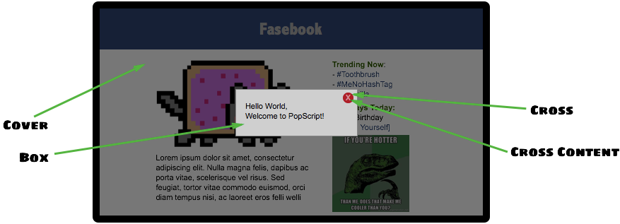

============================================
Chapter 0: Getting started
============================================

Installation
--------------------------------
Let us begin with what comes out of the box, you will need these to start popping:

- ``popscript.js`` or ```popscript.min.js``
    This is the entire source of PopScript.

- Boilerplate

    | PopScript is about declaring your pop ups in declarative script format.
    | By default, PopScript offers a robust boilerplate which handles a diverse case of pops: lightboxes, context menus, tooltips, and more.
    | To use this boilerplate, simply include the ``popscript-boilerplate.js`` file and ``popscript-boilerplate.css`` files after including `popscript.js`.

How to put in these files?

| Installating via `Web Componenets <https://www.w3.org/TR/components-intro/>`_ is currently on the wish list and therefore unavailable.

Installing via `Bower <https://bower.io/>`_ can be done using the following command::

    > bower install popscript

| To install via the conventional way, click on the `download </v2/download.html>`_ button located in the header of the website.
|

Your webpage would look like this::

    <html>
        <head>
        ......................
        <script type="text/javascript" src="popscript.js"></script>
        ......................
        <script type="text/javascript" src="popscript-boilerplate.js"></script>
        <link rel="stylesheet" type="text/css" href="popscript-boilerplate.css" />

        ......................
        </head>
        <body>
        ......................
        <button onclick="PS.pop('hello world')">Click Me!</button>
        ......................
      </body>
    </html>

**OR**::

    <html>
        <head>
            ......................
        </head>
        <body>
            ......................
            <button id="more-info">Click Me!</button>
            ......................
        </body>

        <script type="text/javascript" src="popscript.js"></script>
        ......................
        <script type="text/javascript" src="popscript-boilerplate.js"></script>
        <link rel="stylesheet" type="text/css" href="popscript-boilerplate.css" />

        <script type="text/javascript">
            document.getElementById("more-info").onclick =
            function(){PS.pop('hello world') }
        </script>
    </html>


Namespace
----------------------------

PopScript contains only 1 name in the global namespace:

    - PS


.. _popscript-class:

PopScript Class
----------------------
PopScript classes (aka pop classes) are very much like CSS classes. This design decision was intentional.
In the `popscript-boilerplate.js` file we have something like this::


    PS.compile({
      general: {
          STYLE: {
              CLASS: {
                  box: 'simple-box',
                  cover: 'curtain',
                  cross: 'cross'
              }
          },
          ANIMATION: {
              IN: {
                  box: 'zap-in cubic-bezier(.55,.27,.8,1.37)',
                  cover: 'fade-in',
                  duration: 200
              },
              OUT: {
                  box: 'zap-out cubic-bezier(.55,.27,.8,1.37)',
                  cover: 'fade-out',
                  duration: 170
              }
          },
          POSITION: {
              x: 'auto',
              y: 'auto'
          },
          esc: 'yup',
          full_draggable: 'yes'
      },

      success: {
          STYLE: {
              CLASS: {
                  box: 'success',
                  cover: 'curtain'
              }
          },
          ANIMATION: {
              IN: {
                  box: 'drop'
              },
              OUT: {
                  box: 'undrop',
                  cover: 'fade-out'
              }
          },
          POSITION: {
              y: 'top'
          },
          cross: 'no',
          full_draggable: 'naaaaoh',
          click_me_out: 'yes, tis is convenient'
      },

        ......
        ......
        ......
    }


| The above is just a small cut of the popscript given on top of the file.
|
| Look at the 2 (parent) keys visible: 'general' and 'success'.
| These are *PopScript classes*.
|
| Look at the few (leaf) keys visible: 'box', 'x', 'y', 'esc', etc.
| These are *PopScript properties*.
|
| Look at the few (in-between) keys visible: 'STYLE', 'INLINE', 'OUT', etc.
| These are *PopScript scopes*.
|
| The 2 main similarities it bears with CSS classes are:


    1. **Structure**: Both PopScript and CSS have a property-value system.

    2. **Inheritance:** 2 or more *CSS classes* can be separated by spaces to form a chain of *CSS classes* which inherit from each other from the left to the right. This is the case for *PopScript classes* too. Example: 'general success'.

| The 2 main dissimilarities it bears with CSS classes are:


    1. **Case Sensitivity**: Both *PopScript properties* and *PopScript scopes* are case insensitive. Which implies that 'box' == 'BoX', and 'ANIMATION' == 'animation'. Note however that the values which *PopScript properties* refer to, and PopScript classes are case sensitive.

    2. **Scopes:** In PopScript there exists *PopScript scopes*, however this feature is not present in CSS.


.. _popscript-boolean:

PopScript Boolean (poolean)
---------------------------------
In most programming languages (including JavaScript) booleans are specified by the keywords ``true`` and ``false``, and in the language of objective C, the keywords ``YES`` and ``NO`` are used. Now given that PopScript is a HTML5 library, and is implemented in JavaScript, the obvious choice of keywords would be the native ones ``true`` and ``false``. These 2 keywords have been chosen, however it was decided to extend these keywords. Its done with PopScript booleans which are (obviously) either ``true`` or ``false``:

    - true
        - Mentioned with JavaScript boolean ``true``
        - Mentioned with any String beginning with a "y" (case insensitive). Eg: ``"yup"``, ``"YESS"``, ``"yEaH buddy!"```

    - false
        - Mentioned with JavaScript boolean ``false``
        - Mentioned with any String beginning with a "n" (case insensitive). Eg: ``"NOOO"``, ``"no way!"``, ``"No, I said no"``

.. _components:

Components of a pop
---------------------


The above contains the 3 components of a pop: cover, box, cross. (cross content is not considered to be a primary component)


Terminology: pop vs Pop
-------------------------

.. _pop:

pop
``````````

pop = the collection of DOM elements mentioned above in :ref:`components`.

.. _pop-instance:

Pop
``````````

Pop = the instance returned upon calling ``PS.pop()``, this object can be used to manipulate the pop via javascript using methods described in :doc:`pop-methods`.


The 2 steps: (1) Compile (2) Create
------------------------------------

(1) Compile: ``PS.compile()``
```````````````````````````````
| ``PS.compile( popscript )`` is used to compile popscript.

(2) Create: ``PS.pop()``
`````````````````````````
| ``PS.pop()`` is the one and only function which you will use to create pops.
| As arguments, it takes in the content (html or DOM node) of the pop, the PopScript class to be used, and additional inline popscript.
| Fine grained details of the arguments are provided in the next chapter.

| **Declaration:**
| ``PS.pop( pop_class , content [, inline_popscript ] )``
|
| **Return:**
| Pop


| An explanation of each of the 3 parameters:


.. _parameter-pop-class:

parameter: pop_class
+++++++++++++++++++++
| Type: **String**
|
| The input here is the pop class for the given pop class which you want your pop to contain. Details of a pop class is given here: :ref:`popscript-class`.


Example::

    PS.pop( "success", "Your transaction was successful!");


parameter: content
+++++++++++++++++++

| Type: **String** / **Node** / **Function**
| The ``content`` parameter contains the inner content of the box (see :ref:`components`)
| It can be of 3 types:

| (1) **String**: This will simply be accepted as the inner HTML of the box.

Example::

        PS.pop( "general", "Hello <b>World</b>" );


| (2) **Node**: This will be accepted as the immediate child node of the box.

Example::

        var info = document.createElement('div');
        var header = document.createElement('h3');
        header.innerText = "Your Account Balance";
        var result = document.createElement('p');
        result.innerText = "500 $";

        info.appendChild(header);
        info.appendChild(result);

        PS.pop( "general", info );


| (3) **Function**: The return value of the function will be accepted as either a (1) **String** or (2) **Node**. (You will notice that this isn't very different from directly providing a string or a node, however the use of this will become more apparent with binders)
| The two main advantages of using functions is (1) Available within a function is a new (local) context for separation of namespace and aesthetics of your code; (2) The :ref:`pop-instance` is available as the first argument of the function callback.
| Note that function executes when upon initial creation of the pop, and will not be subsequently called upon redisplaying a hidden pop.

Example::

    PS.pop (
        "general",
        function (curPop) {
            var info = document.createElement('div');
            var header = document.createElement('h3');
            header.innerText = "Your Account Balance";
            var result = document.createElement('p');
            result.innerText = "500 $";

            info.appendChild(header);
            info.appendChild(result);

            return info;
        }
    );


.. _parameter-inline-popscript:

parameter: inline_popscript
++++++++++++++++++++++++++++
| Type: **Object**
| Optional: Yes
| Default: {}
|
| The input here is addtional popscript. Inline popscript provides a way to specify pop specific popscript properties without having to declare a separate pop class altogether.


Example::

    PS.pop( "general", "You will be unable to destroy this pop by using the 'esc' key.", {esc: "no"} );
